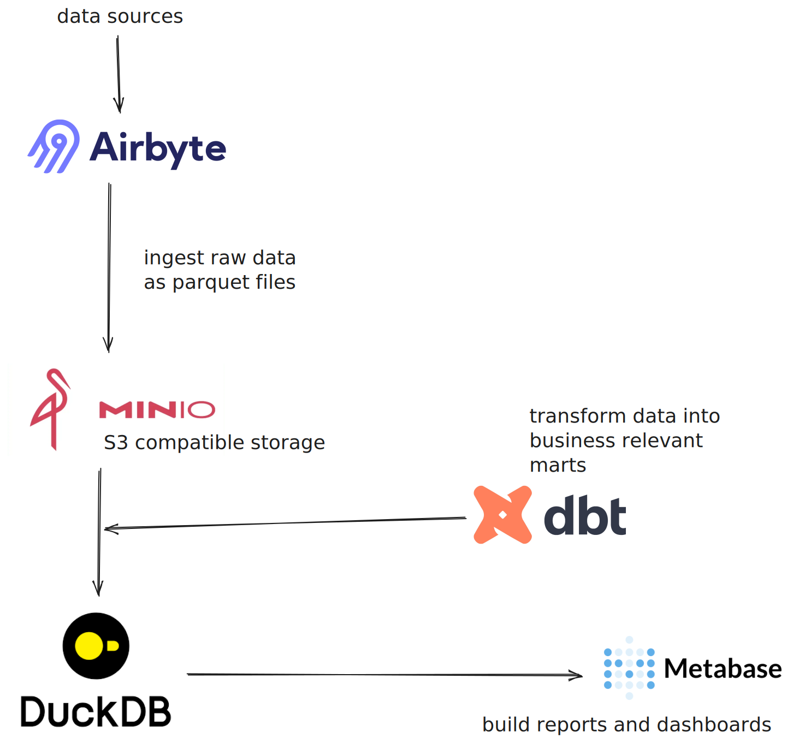

# Analytics OS
  
> Not all data is big data. 


Most businesses struggle with analytics not because of the size of their data but because it is disjoined. What is needed is a simple way to bring all relevant data sets together, build models ontop of them and serve them in reports and dashboards to BI stakeholders. 

# Project Setup

This projects spins up all necessary services to 

- ingest data from different systems via **Airbyte**
- store it in a local **MinIO** bucket
- process and model it with **DBT** and **duckDB**
- create dashboards on **Metabase**



Additionally it uses Postgres to store configuration of Airbyte and Metabase.

# Setup

We need docker, make sure it has enough RAM available (e.g. 8GB).

## Transform, Load and Show

Use docker compose to spin up all services:

```
docker-compose up
```

This will run

- MinIO Bucket on port 9000
- MinIO UI on port 9001
- Metabase on port 3030
- Postgres on port 55432

### Connect Metabase to the DuckDB warehouse

In Metabase add a database, select DuckDB and point it to `/var/data/warehouse.db`.
Select `Establish a read-only connection` and add `access_mode=read_only` to "Additional DuckDB connection string options" in "Advanced Settings.

## Airbyte

Running Airbyte via Docker is deprecated as Airbyte itself needs to spin up processes. Instead the recommended way to run it locally is via K8S. Airbyte provides a CLI tool for that `abctl` that sets up the cluster and installs all necessary resources.

To let Airbyte use the Postgres database that is running via docker compose we need create a secret and patch the helm chart via `airbyte/values.yaml`.
To make sure kind uses a fixed gateway to the host we create the network by hand:

```
docker network create --driver=bridge --subnet=172.25.0.0/16 --gateway=172.25.0.1 kind
```

and then install Airbyte with the given values.


```
abctl local install -v --secret airbyte/airbyte-secret --values airbyte/values.yaml --insecure-cookies
```

Once deployed Airbyte is reachable at http://localhost:8000. 

Get the initial password via

```
abctl local credentials
```

### Add MinIO as a data destination

Use these values to set up the destination

```
{
  "name": "S3",
  "configuration": {
    "s3_bucket_region": "us-east-1",
    "format": {
      "format_type": "Parquet",
      "page_size_kb": 1024,
      "block_size_mb": 128,
      "compression_codec": "UNCOMPRESSED",
      "max_padding_size_mb": 8,
      "dictionary_page_size_kb": 1024
    },
    "s3_endpoint": "http://host.lima.internal:9000",
    "access_key_id": "minio",
    "secret_access_key": "minio123"
    "s3_bucket_name": "raw",
    "s3_bucket_path": "/",
  }
}
```

To use the sample data for the example models add a file source targeting `https://onlinetestcase.com/wp-content/uploads/2023/06/200KB.csv`.

# Modeling with DBT

You can edit the DBT project in `dbt/analyticsOS`. Use the staging folder to load any external sources from the MinIO bucket. These are materialised as views in DuckDB, so cannot and should not be used in Metabase. 

Instead build marts ontop of the staged data. These, in the `marts/` folder, are materialised as tables and are available in Metabase.

To run DBT and update the models run 

```
./refresh
```

This will run the models and trigger a Metabase restart. This is necessary as Metabase keeps the DuckDB data in memory.