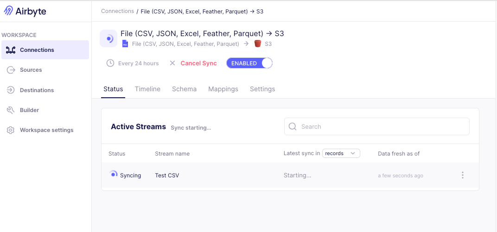

# Deploy to Hetzner

## Create the server

I used a cx43 with 16Gb RAM and 160Gb of disk. The monthly costs are ~10 euro. Add a ssh key during the setup and connect to the server with root

```
ssh -l root <seriver-PI>
```

First thing we do is to set up the firewall settings

sudo apt update
sudo apt install ufw -y
sudo ufw default deny incoming
sudo ufw allow OpenSSH
sudo ufw allow 80    # HTTP
sudo ufw allow 443   # HTTPS
sudo ufw enable
sudo ufw status verbose

This will limit any traffic in case we accidentally expose services.

## Set up DNS records

You want an easy to remember name and also be able to use https. For this tutorial we set up free DNS records with [DuckDNS](https://www.duckdns.org). As DuckDNS does not allow us to use subdomains we create to records, one for Airbyte and one for Metabase. Both should be linked to the server's IP.

In my case I created

- airbyte-analytics-os.duckdns.org
- metabase-analytics-os.duckdns.org

Both these should point to our server, we will use a reverse proxy to route traffic to the correct service.

## Docker

Follow the official instructions to install Docker (https://docs.docker.com/engine/install/ubuntu/#install-using-the-repository)

## Airbyte

Airbyte deprecated the use of Docker or Docker Compose directly but instead spins up a K8S cluster. Using their [official installation tool `abctl`](https://docs.airbyte.com/platform/using-airbyte/getting-started/oss-quickstart#part-2-install-abctl) works fine. Install with

```
curl -LsfS https://get.airbyte.com | bash -
```

## Analytics OS

Clone the repo

```
git clone https://github.com/meyerzurheda/analytics-os.git
cd analytics-os
```

## Config

We set the correct domain names in our `.env`

```
cp .env.local .env
vim .env
```

## Spin up services

First we spin up all services defined in docker compose. This will run

- MinIO (S3 compatible storage)
- Create a bucket `raw` in MinIO
- Metabase
- Postgres (to server as a config store for Metabase and Airbyte)
- Caddy (reverse proxy)
- DBT container (to run models and store them in a DuckDB file)


```
docker compose up -d
```

The first run of the DBT service container will produce errors, as the referenced source data does not exist yet.

The metabase container will take some time to set up internally, you can check the progress 

```
docker compose logs metabase -f
```

Once ready, navigate to your metabase domain name and finish setting up Metabase by creating an Admin account.

## Airbyte

As mentioned, Airbyte also runs in Docker but inside its own K8S cluster. This can be installed with

```
abctl local install -v --secret airbyte/airbyte-secret --values airbyte/values.yaml --insecure-cookies
```

This may take a couple of minutes. We allow the --insecure-cookies flag because all services are set behind the Caddy reverse proxy that handles ssl.

When Airbyte is ready we can can use the airbyte domain url to set up out Admin account. The password can be obtained via

```
abctl local credentials
```

## Set up your first pipeline

A full pipeline consists of the parts

- Loading data from a source system into raw storage
- Transforming the raw data into marts
- Building reports and dashboards ontop of the marts

### Ingest data

To load some data we can use [onlinetestcase.com](https://onlinetestcase.com) and set 

In Airbyte we set up a File Source and name it `Test CSV` (The naming here is important as it defines the location of the data source in our bucket).

For reference here the Airbyte JSON config:

```
{
  "name": "File (CSV, JSON, Excel, Feather, Parquet)",
  "configuration": {
    "format": "csv",
    "provider": {
      "storage": "HTTPS",
      "user_agent": false
    },
    "url": "https://onlinetestcase.com/wp-content/uploads/2023/06/200KB.csv",
    "dataset_name": "Test CSV"
  }
}
```

As a destination we will set up the MinIO bucket we created earlier. As this is a S3 compatible storage, use the S3 destination and set it up with these values:

```
{
  "name": "S3",
  "configuration": {
    "s3_bucket_region": "us-east-1",
    "format": {
      "format_type": "Parquet",
      "page_size_kb": 1024,
      "block_size_mb": 128,
      "compression_codec": "UNCOMPRESSED",
      "max_padding_size_mb": 8,
      "dictionary_page_size_kb": 1024
    },
    "s3_endpoint": "http://minio:9000",
    "access_key_id": "minio",
    "s3_bucket_name": "raw",
    "s3_bucket_path": "/",
    "secret_access_key": "minio123"
  }
}
```

The bucket is reachable via the docker network `kind`. Here we use the default user and password defined in `docker-compose.yaml`. Feel free to adjust.

Once source and destination are set up create a Connection and sync.



This will load the CSV as parquet files into our MinIO bucket.

### Transform the data

There are already two models predefined 

- a staging model (dbt/analyticsOS/models/staging/stg_data.sql) that loads the data from the bucket into DuckDB. This model is materialised as a view. 
- a marts model (dbt/analyticsOS/models/marts/data.sql) that is based on business logic and only includes the data needed by analysts. This model is materialised as a table.

DBT is preconfigured and packaged in a dedicated image. You can run it with

`
./refresh
`

This will run DBT and restart Metabase, this is needed so Metabase fetches the updated models.

You can check that the model was created with duckdb (need to install `curl https://install.duckdb.org | sh`)

```
duckdb DuckDB/warehouse.db
D select * from data;
```

### Create a Report

In Metabase we need to set up DuckDB as our main data base. For this add a new database:

Display Name: `Warehouse`
Database File: `/var/data/warehouse.db`

Check `Establish a read-only connection`.

Under advanced options add `access_mode=read_only` to the additional DuckDB connection string options.

Once the Database is connected we can use the table `data` to create a report:


## Summary

In this tutorial we created a complete data lakehouse analytics setup that can be extended straightforwardly.

### Next steps

This serves as a proof-of-concept on how to connect all necessary pieces. To use in day to day one could 

- expose the MinIO UI to the reverse proxy so it can be accessed (really change the passwords before though)
- run `./refresh` in a cronjob to keep models up to date
- add a `git pull` to the cronjob so new model definitions are downloaded
- expose the DBT docs for easy model browsing
- add a persistent volume to the server for backup
- etc. etc.